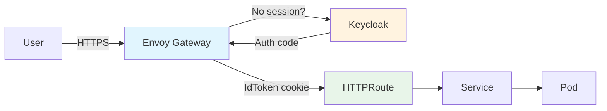

+++
title = "Building a Software Pack"
+++

This guide walks you through building, deploying, and maintaining a **Nebari Software
Pack** - a Kubernetes application packaged to integrate with the Nebari platform's
shared routing, TLS, and OIDC authentication.

## What is a software pack?

A **software pack** is any Kubernetes deployment that includes a **NebariApp** custom
resource. The NebariApp tells the
[nebari-operator](https://github.com/nebari-dev/nebari-operator) to auto-configure:

- **Routing** - creates an HTTPRoute on the shared Envoy Gateway
- **TLS** - provisions a certificate via cert-manager
- **Authentication** - sets up Keycloak OIDC via an Envoy Gateway SecurityPolicy

The NebariApp CRD is the integration point between your application and the Nebari
platform. How you deploy the rest of your application is up to you - **Helm charts,
Kustomize overlays, and plain YAML manifests** are all supported.

## Getting started

Use the [nebari-software-pack-template](https://github.com/nebari-dev/nebari-software-pack-template)
as your starting point. Click **Use this template** on GitHub to create your own repo,
then pick the example that matches your use case:

| Example | Best for |
|---------|----------|
| `examples/vanilla-yaml/` | Plain `kubectl apply`, no tooling |
| `examples/kustomize-nginx/` | Per-environment overlays |
| `examples/basic-nginx/` | Simplest Helm chart |
| `examples/auth-fastapi/` | Custom app that reads auth tokens |
| `examples/wrap-existing-chart/` | Wrapping an existing upstream Helm chart |

## Guide sections

- **[Concepts](/concepts/)** - pack structure, deployment methods, examples overview
- **[NebariApp CRD Reference](/nebariapp-crd-reference/)** - complete field-by-field reference
- **[Authentication Flow](/auth-flow/)** - how OIDC works end-to-end; reading the IdToken
- **[Release Readiness](/release-readiness/)** - maturity levels and the promotion checklist

## Pack metadata and the dashboard

Every tracked pack has a `pack-metadata.yaml` at its repo root. The
[software pack dashboard](https://github.com/nebari-dev/software-pack-dashboard) reads
this file to track maturity level, ownership, and integration status. Once your pack is
listed in `tracked-packs.yaml`, the dashboard surfaces it automatically.

To opt your pack's docs site into the portal at `packs.nebari.dev/<slug>/`, see the
[Documentation portal](#documentation-portal) section of the template README.
